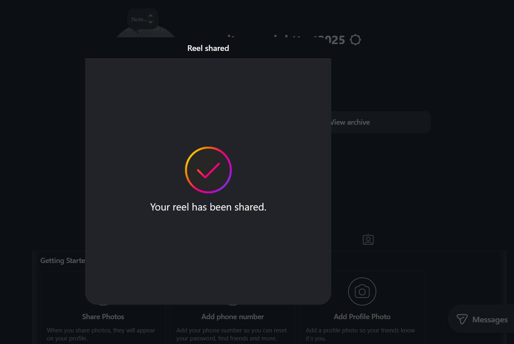
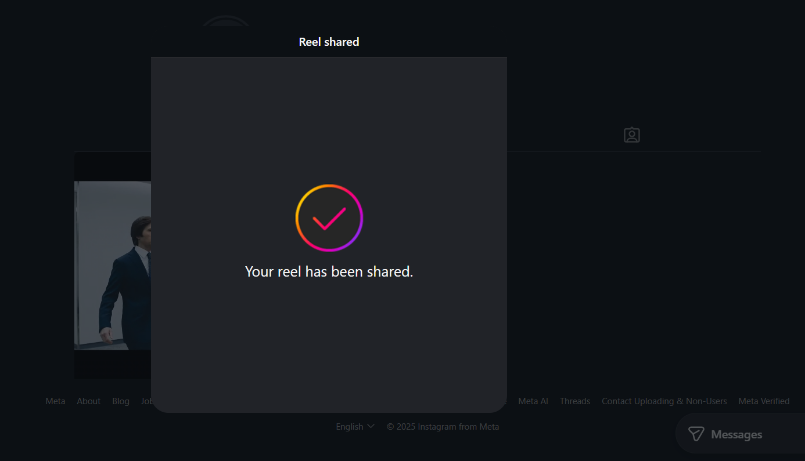
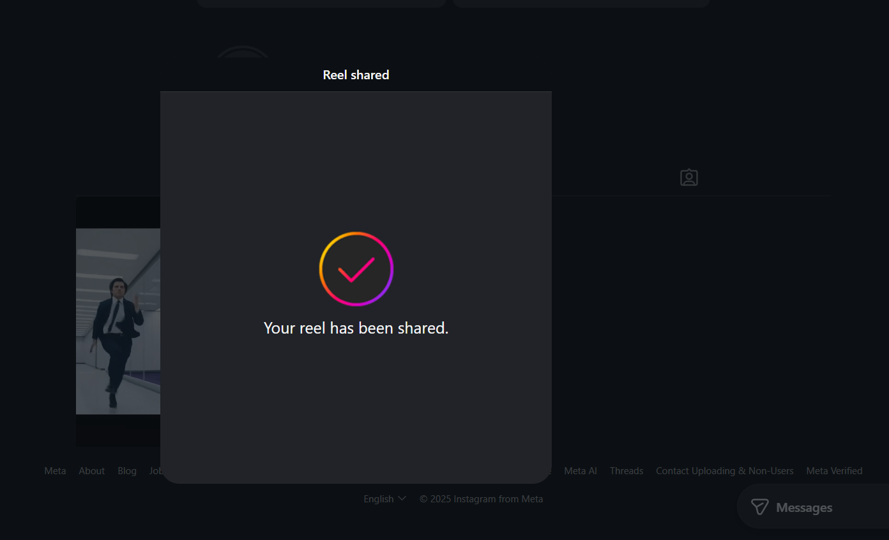
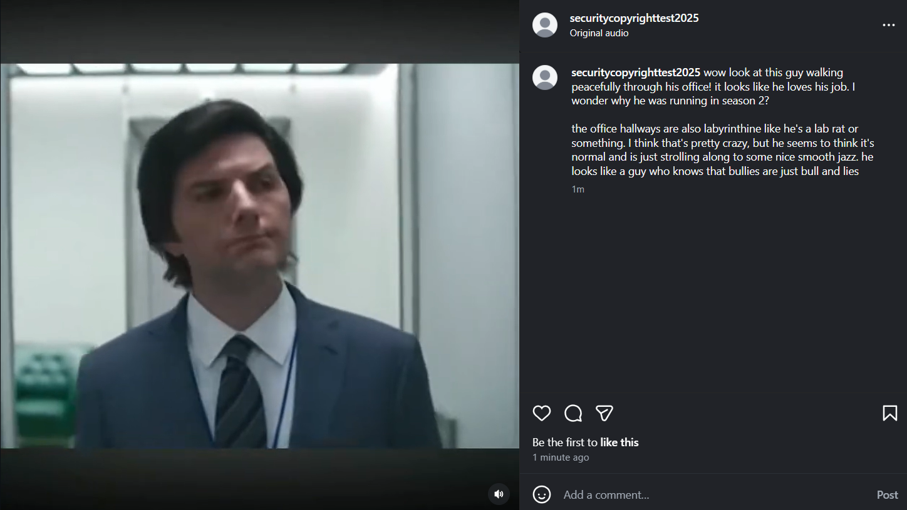
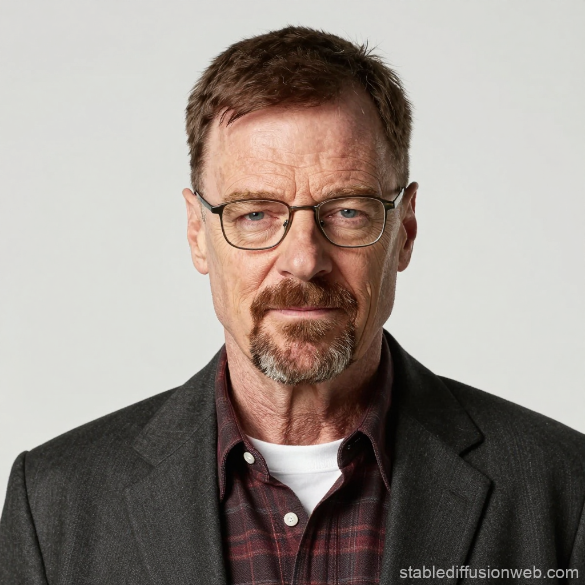
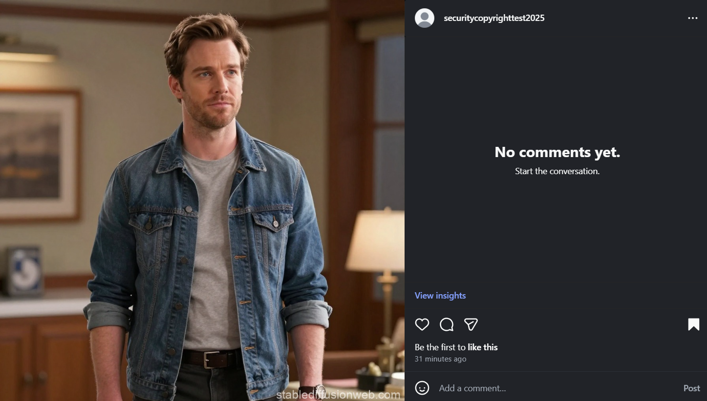

For this assignment, I will use an Instagram account titled securitycopyrighttest2025.

1. Instagram detects copyrighted content using both automated systems and manual reporting. The automated methods include Audible Magic, which compares hashes of uploaded content to known copyrighted materials (if the hashes match, the upload is flagged). Users can also manually report any post they see for copyright infringement, and a copyright holder can submit a formal takedown via Instagram's online forms (there is a process for DMCA-specific complaints, and another for those outside the DMCA).
When content is flagged as potentially infringing a copyright, that content is usually deleted as a pre-emptive measure. If the audio portion of a post is the only infringing part, then the sound may be muted and the photos or video allowed to remain. The uploader of this content is notified, and if the removal was a result of an official complaint by a copyright holder, the uploader is provided with that party's contact information.
Uploaders can file a DMCA counter-notification after an official DMCA takedown only in the case of a mistake or misidentification of the content. A valid counter-notification will result in the content being restored unless the alleged copyright holder files a court action to keep the content removed. If content was removed due to a non-DMCA copyright report, users can submit an appeal to Instagram, which will be approved and the content restored if the initial report was a mistake or the content is not actually infringing.
Content can be monetized as long as it is completely original or only consists of fair use of copyrighted content (and it conforms to the rest of the Content and Partner Monetization Policies). If a copyright claim is submitted, the corresponding content can no longer be monetized for the uploader. In egregious cases, the copyright holder can sue for damages if the infringing content was monetized enough.
For users who repeatedly post infringing content, their accounts may be disabled or their use of Instagram may be limited.
Instagram has made agreements with many artists for portions of their songs to be freely posted by personal accounts (i.e, not monetized). Thus, using any music from Instagram's built-in library for a post from a non-business account is not copyright infringement.

2. For the first experiment, I uploaded two clips (one of seven seconds, the next of two minutes) to Instagram Reels of the TV show Severance, which is definitely copyrighted. Both were uploaded successfully and as of the morning of December 13, no action has been taken against them.    
For the second experiment, I uploaded another clip of Severance, but this time I included my own original commentary in the caption to constitute fair use. This clip was also uploaded successfully and still remains posted.  
The short clip and the longer clip with commentary both received significantly more views than the longer clip with no commentary, to the point where I suspect the latter clip was shadowbanned (it has only one view).

3. Interestingly, I tried generating content with a direct reference to copyrighted characters, but ChatGPT refused and said this was a violation of its content policy. (Prompt: "Create an image of Walter White, Junior" Response: "This image generation request did not follow our content policy.") In addition, the prompt "Create an image of a character in the style of Walter White, Junior" produced the same response.
So instead, I used Stable Diffusion. The first prompt was "Create an image of Walter White, Junior" and the second was "Create an image of an original live-action TV show character." The outputs are attached as walt\_jr.png and original\_live\_action\_character.png. I uploaded both images to Instagram without issue, and the platform has not responded as of December 13 morning.    
Stable Diffusion's FAQ page states that copyright is a complex issue that depends on jurisdiction, and does not elaborate further on the topic. They also acknowledge that there was no opt-in or opt-out function for the inclusion of artists' copyrighted work in the training data, as long as such work was accessible on the Internet. Stable Diffusion-generated images are licensed under the Creative Commons 1.0 Universal Public Domain Dedication, meaning the images belong to the public domain and nobody holds copyright over them. Meta's (and Instagram's) policy on AI-generated content is that it is allowed, but users who upload realistic AI-generated content must add an AI label (this label is optional if the content is not realistic). If Meta decides some AI-generated content may deceptively represent an important topic, such as providing fake news, they may impose a more obvious AI label.

4. My first experiment (raw copyrighted clips) does not follow all of the fair use factors. Most prominently, it is not transformative, since it is just a verbatim copy. The nature of the copyrighted work is a published creative TV show, so there is less leeway for using it. However, the amount and substantiality is relatively small, at least for the seconds-long clip, compared to the length of the TV episode. Also, the effect on the potential market is very low because 1) my Instagram account has no followers, and 2) the market is people who want to watch the show, and I only posted out-of-context clips which would not satisfy the consumers in this market.
My second experiment (commentary on a clip) is more acceptable under fair use. My commentary is original and adds my own expression to the original work, so it is transformative. In addition, the amount and substantiality of the work copied is still somewhat small (only two minutes out of an hour-long episode), and the effect on the potential market is still low, as with the previous clips. However, the nature of the copyrighted work is still creative.

I noticed no major gaps between the legal theory and Instagram's copyright policy, which both state that disseminating copyrighted content is not allowed. Instagram also explicitly complies with the Digital Millennium Copyright Act. However, Instagram's policy diverges from its actual enforcement, as my verbatim copies of copyrighted content, as well as an AI-generated image that strikingly resembles a copyrighted character, faced no consequences. This is likely due to a difficulty of implementation, since the automated system is unlikely to detect every single infringement and there are not enough manual reviewers for the massive amount of content shared to Instagram.

5. https://www.instagram.com/securitycopyrighttest2025/ All content was uploaded between 2 and 4 AM on December 13, 2025.
